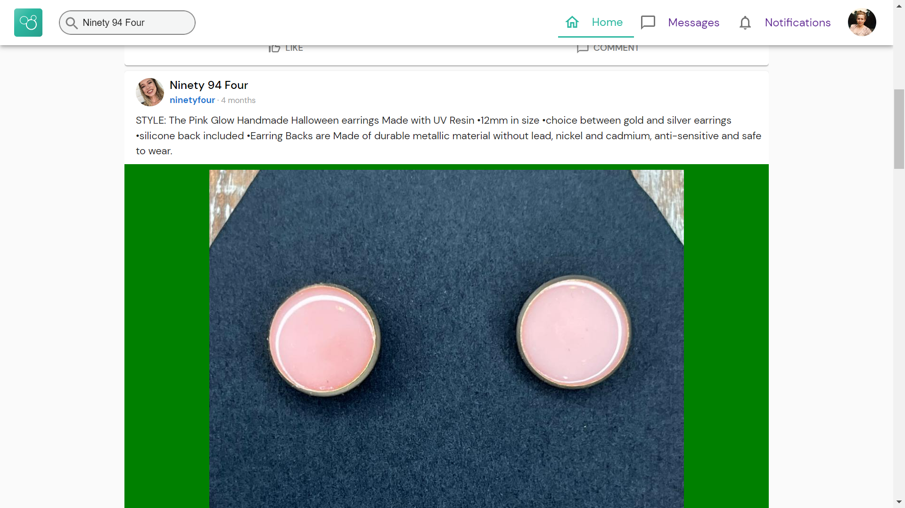

# Tedooo Assignment App:

## About my project:

A static web application that displays Tedooo's feed page. \
This application was part of a home assignment for the Front-End position at Tedooo.

## Technologies:

- **[React](https://reactjs.org/)**
- **[TypeScript](https://www.typescriptlang.org/)**

## Packages:

- **Front-end** :

  - [Redux RTK & Query](https://www.npmjs.com/package/@reduxjs/toolkit) - For state and data-fetching management.
  - [React Router](https://www.npmjs.com/package/react-router-dom) - For routes management.
  - [Material UI](https://www.npmjs.com/package/@mui/material) - for UI components
  - [date-ns](https://date-fns.org/)- For dates manipulation.
  - [react-infinite-scroller](https://github.com/danbovey/react-infinite-scroller) - For feed infinite scrolling.
  - [react-intersection-observer](https://github.com/thebuilder/react-intersection-observer) - For tracking the posts the user hasn't watched yet

## Installation

1. **Clone the repo**
   ```
   git clone git@github.com:rom-orlovich/tedooo-assignment.git
   ```
2. **Install all the dependencies**
   ```
   npm run ci
   ```
3. **Run Client**

   ```
   npm run start
   ```

4. **Go to http://localhost:3000 and have fun**!

## Main Features:

1. **Fetching Posts From Tedooo's API**- Fetching and displaying posts from Tedooo's API.
2. **Infinite Scrolling**:
   - Scroll down until there are no more posts to display.
   - For each scroll event, six new posts will show.
3. **Autocomplete Search Input**:
   - Suggesting a list of post's title names from Tedooo's API.
   - The user can search posts by title and display the results on the feed.
4. **Posts Memorization**:
   - Change the URL's query parameters if the user has already watched the post.
   - Save the indicator if the user watched the post in the local storage.
   - When the user will watch the post again, the URL won't change.

## What's next?:

- **Implements CRUD Actions of Posts, Comments, Likes** - Create/Read/Update/Delete posts, comments, likes.
- **React App Optimizition**:
  - Minimizing Material UI bundling size.
  - Optimizing posts' images loading.
  - Implementing components' lazy loading.
- **Cypress Tests** - Implementing End to End tests using Cypress.
- **Improving App's Style**.

## Images:

### Home Page


### Search Posts




### Mobile Display


### App's Tests


